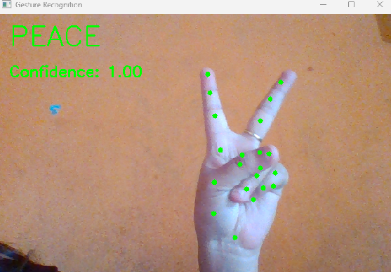
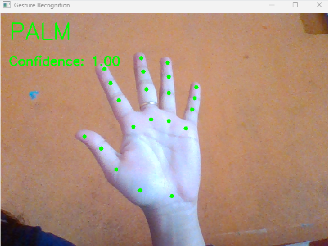
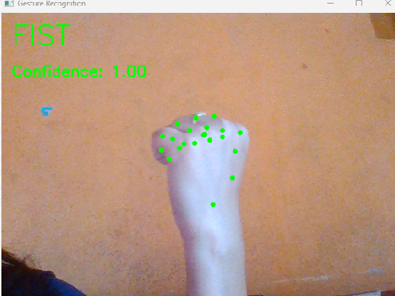
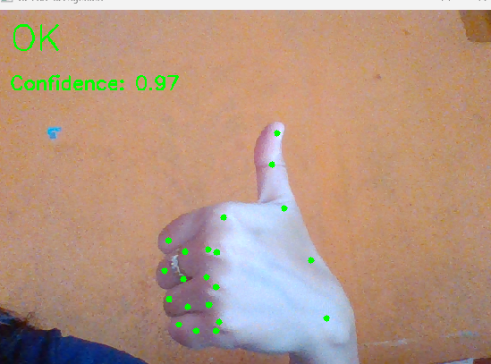
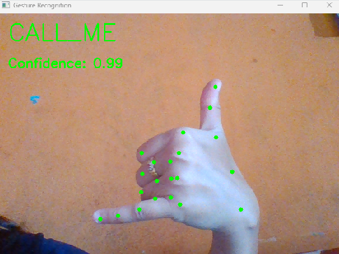
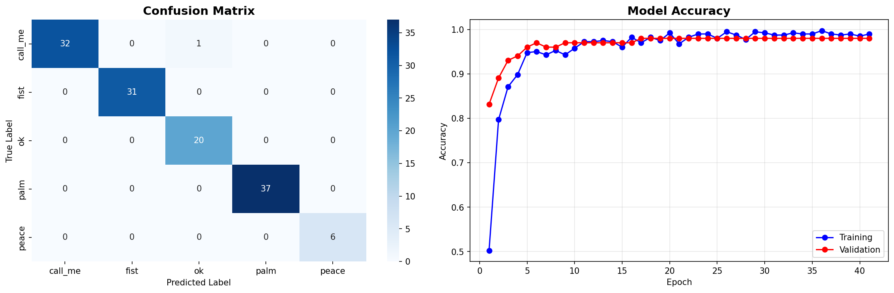

# Hand Gesture Recognition System

A real-time hand gesture recognition system developed using Python, TensorFlow, MediaPipe, and OpenCV.

## Overview

This project recognizes hand gestures from a webcam feed. It uses MediaPipe to detect hand landmarks and a TensorFlow model to classify gestures in real time.

## Features

- Real-time gesture detection
- Hand landmark extraction using MediaPipe
- TensorFlow-based gesture classification
- Custom gesture data collection
- Model training and evaluation
- Live prediction through webcam


## Screenshots

### Peace Gesture



### Palm Gesture



### Fist Gesture



### OK Gesture



### Call_me Gesture



### Model Evaluation




## Technologies Used

- Python
- TensorFlow
- MediaPipe
- OpenCV
- NumPy
- Scikit-Learn
- Matplotlib
- Seaborn

## Project Structure

```
gesture_recognition_system.py
images/
models/
gesture_data/
README.md
requirements.txt
```


## Installation

Clone the repository:

```bash
git clone https://github.com/npatil09/gesture-recognition-tensorflow.git
```

Install the required libraries:

```bash
pip install -r requirements.txt
```

## Usage

Collect gesture samples:

```bash
python gesture_recognition_system.py --mode collect --gesture peace
```

Train the model:

```bash
python gesture_recognition_system.py --mode train
```

Start real-time detection:

```bash
python gesture_recognition_system.py --mode detect
```

## Supported Gestures

- Fist
- Palm
- Peace
- OK
- call_me

## Future Improvements

- Add more custom gestures
- Improving model accuracy
- Gesture-controlled system actions
- Presentation control using gestures

## LICENSE

MIT — feel free to use, adapt, and build on this.